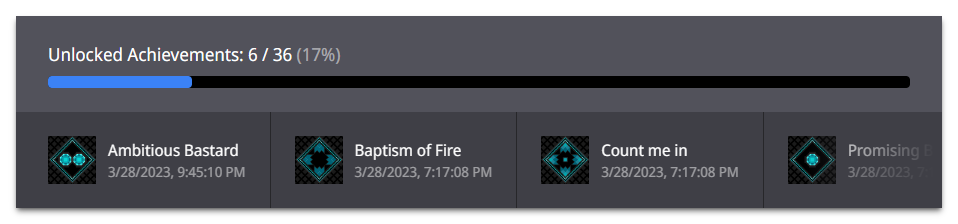

# Hulki

> Companion providing a widget displaying your Steam achievements in the game you're playing.

## Setup

1. Install [Go](https://go.dev/dl) and [Node.js](https://nodejs.org/en/download)
2. Clone or download the repository
4. Go to the main folder and run `go mod download` in a terminal
3. Go to the `web` folder and run `npm install` followed by `npm run build` in a terminal

## Usage

1. Go to the main folder, edit `config.toml` accordingly then run `go run .` in a terminal
2. Add a new browser source in your broadcast software with the URL displayed in the terminal

## License

Copyright (c) 2023-present Alexandre Breteau

This software is released under the terms of the MIT License.
See the [LICENSE](LICENSE) file for further information.
